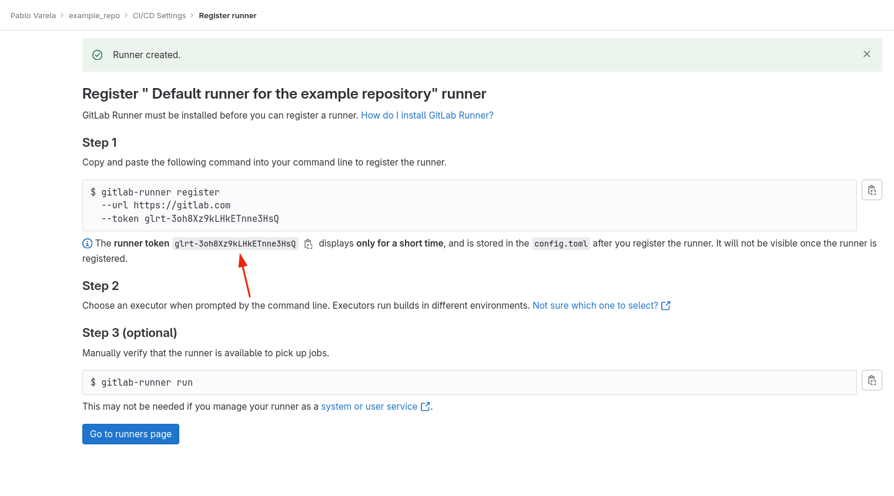

A repository to deploy GitLab runners on AWS EC2 Spot instances, using the docker machine executor.

It addresses the needs of engineers that:

- Use Gitlab for continous integration.
- Use the AWS CDK for infrastructure-as-code.
- Prefer to host their own runners over using the shared runners, as they know their limitations.
- Need autoscaling. Cannot run all of their company's jobs on a single machine.
- Do not use Kubernetes, or prefer the docker machine executor over the kubernetes one.


<br/>


<br/>
<details>
<summary><font size="+2">Infrastructure diagram</font></summary>


</details>

<br/>

# Similar repositories

If you use Terraform instead of the CDK, consider [terraform-aws-gitlab-runner](https://github.com/cattle-ops/terraform-aws-gitlab-runner).

| Stars | IaC Tool | Repository |
| --- | --- | --- |
| [](https://github.com/cattle-ops/terraform-aws-gitlab-runner/stargazers/) | Terraform | [terraform-aws-gitlab-runner](https://github.com/cattle-ops/terraform-aws-gitlab-runner) |
| [](https://github.com/pepperize/cdk-autoscaling-gitlab-runner/stargazers/) | CDK in Typescript | [cdk-autoscaling-gitlab-runner](https://github.com/pepperize/cdk-autoscaling-gitlab-runner) |
| [](https://github.com/neilkuan/cdk-gitlab-runner/stargazers/) | CDK in Typescript | [cdk-gitlab-runner](https://github.com/neilkuan/cdk-gitlab-runner) |
| [](https://gitlab.com/guided-explorations/aws/gitlab-runner-autoscaling-aws-asg/stargazers/) | Cloudformation | [gitlab-runner-autoscaling-aws-asg](https://gitlab.com/guided-explorations/aws/gitlab-runner-autoscaling-aws-asg) |
| [](https://github.com/aws-samples/amazon-ec2-gitlab-runner/stargazers/) | Cloudformation | [amazon-ec2-gitlab-runner](https://github.com/aws-samples/amazon-ec2-gitlab-runner#terminate-the-gitlab-runner) |
| [](https://github.com/riemers/ansible-gitlab-runner/stargazers/) | Ansible | [ansible-gitlab-runner](https://github.com/riemers/ansible-gitlab-runner) |
| [](https://github.com/philips-labs/terraform-aws-github-runner/stargazers/) | Terraform (Github Actions) | [terraform-aws-github-runner](https://github.com/philips-labs/terraform-aws-github-runner) |
| [](https://github.com/CloudSnorkel/cdk-github-runners/stargazers/) | CDK in Typescript (Github Actions) | [cdk-github-runners](https://github.com/CloudSnorkel/cdk-github-runners) |


# Contents

0. [Glossary](#glossary)
1. [Basic usage](#basic-usage)
2. [Scenarios:](#scenarios)
    - [Deploy multiple runners within the same bastion instance](#scenario-deploy-multiple-runners-within-the-same-bastion-instance)
    - [Deploy multiple runners in different bastion instances](#scenario-deploy-multiple-runners-in-different-bastion-instances)
    - [Grant permissions to aws services](#scenario-set-permissions-to-aws-services)
    - [Grant permissions to private container image repositories](#scenario-set-permissions-to-aws-services)
    - [Do a multi-region deployment](#scenario-do-a-multiregion-deployment)
    - [Customize the networking configuration](#scenario-customize-the-networking-configuration)
    - [SSH into the bastion instance](#scenario-ssh-into-the-bastion-instance)
3. [Next Gitlab Runner Auto-scaling architecture](#next-gitlab-runner-auto-scaling-architecture)

# Glossary

<details>
<summary>Click to expand</summary>

## Terms throughout the Gitlab docs:

-  **GitLab Server**: The Ruby on Rails application that offers code repositories, issue tracking, and more. Can be hosted on GitLab.com or self-hosted. This repository does not cover it.

- **gitlab instance**: The infrastructure that hosts the GitLab Server.

- **GitLab Runner**: The Go application that enables CI/CD job execution on specified platforms.

- **runner (worker)**: A process responsible for executing jobs. It is set up by running the `gitlab-runner register` command  on a host that has GitLab Runner installed. Multiple workers can be registered on the same host. Gitlab Runner updates a file named **config.toml** after each worker registration. The file ends up having a `[[runner]]` section for each worker. The GitLab docs often refers to the workers as "runners".

- **authentication token**: A token generated in the GitLab Server, which is needed to register a worker. 

- **runner (agent)**: A group of one or more workers sharing the same authentication token. They appear as a single runner in the GitLab UI. 
Each runner acts as a unit that polls the gitlab instance for jobs, executes them, and sends the results back to the instance. They are not to be confuused with workers, which are often refered to as "runners". They are also not to be confused with the "GitLab Agent" for Kubernetes, a software that links a Kubernetes cluster with a gitlab instance. 

 - **executors**: Guidelines that a worker follows to prepare job execution environments. Chosen based on the infrastructure requirements and specified during the worker registration. The most common executors for autoscaling in production are the docker machine and kubernetes ones.

- **docker executor**: An executor that runs jobs on Docker hosts that live on the same underlying infrastructure as the worker.

- **docker machine executor**: An autoscaling version of the docker executor. It creates separate virtual machines on different physical infrastructure to run the jobs, with each virtual machine handling one job at a time.

- **Docker Machine**: Software that creates Docker hosts on virtual machines across various platforms. Workers using the docker machine executor utilize this software.

- **virtual machines**: Computer system instances that emulate physical computers. In the context of the docker machine executor, virtual machines are hosts that a worker creates on separate physical infrastructure. Specifically for this repository, these virtual machines reside on AWS EC2 instances.

- **runner manager**: A worker that registers other workers to run jobs. If it uses the docker machine executor, the machine hosting this worker serves as a bastion host for the physical servers where the virtual machines reside. The GitLab docs sometimes refer to the bastion host as the runner manager.

- **child runners**: The workers that a runner manager using the docker machine executor registers as subprocesses on separate virtual machines. Of the workers involved in the docker machine executor setup, these are the ones that directly execute the jobs.


## Terms used in this repository:

- **worker/runner manager/child runner**: These terms will refer to a runner (worker).

- **runner**: This term wil refer to a runner (agent).

- **bastion instance**: This term will refer to an EC2 instance that hosts at least one runner manager.

- **child instance**: This term will refer to an EC2 instance that hosts a child runner.


## Sources:

- [Gitlab docs search function](https://docs.gitlab.com/)
- [Gitlab Runner glossary](https://docs.gitlab.com/runner/#glossary)
- [Gitlab Runner glossary, next architecture](https://docs.gitlab.com/ee/architecture/blueprints/runner_scaling/#glossary)
- [Gitlab docs issue pages](https://gitlab.com/gitlab-org/gitlab/-/issues/398139)

</details>
<br/>

# Basic usage

0. Prerequisites:

    - Configure the AWS CLI and bootstrap the AWS CDK.
    - Validate your GitLab account. If you don't, you may encounter an error when the CI pipeline runs. Alternatively, you can disable shared runners for your projects.

    <br/>

    <div style="margin-left: 25px;"></div>

    <br/>

    - Create a Python virtual environment, activate it, and install the requirements. For example, on Ubuntu:

    <br/>
    
   <div style="margin-left: 25px;">

    ```bash
    git clone https://github.com/PbVrCt/cdk-gitlab-runners.git
    cd cdk-gitlab-runners
    python3 -m venv .venv
    source .venv/bin/activate
    pip install -r requirements.txt
    ```

    </div>

1. Create a new runner using the Gitlab UI. Record the authentication token which the system returns to you:

    

    

2. Store the token in AWS Systems Manager Parameter Store. Record the parameter name which you give to the secret.

    ```bash
    aws ssm put-parameter --overwrite --type SecureString  --name "/GitlabRunners/DefaultRunnerToken" --value <your-token> --region "<your_region>"
    ```

3. Replace the values in **src/config/config.example.json** file with your account, region and the parameter name from step 2. Rename the file to **config.json**.

    > NOTE:
    > For personal use, you may specify `use_nat_gateways: false`, to save money. The deployment will occur on public subnets, but the security group will still block inbound traffic. This is not a best practice.


    ```json
    {
    "account_id": "<your_account_id>",
    "region": "<your_region>",
    "token_secret_name": "/GitlabRunners/DefaultRunnerToken",
    "project_name": "GitlabRunners",
    "use_nat_gateways": true
    }
    ```

4. Deploy the infrastructure:

    ```bash
    cdk deploy prod/\*
    ```

    After the deployment finishes, the runner should appear as online in Gitlab, in your project's CI/CD section:

    

5. Check that everything works:

    In your project, create a .gitlab-ci.yml file and make a commit that triggers a job. You should see an EC2 instance being spawned to run the job.

    If, for the same runner, you trigger several jobs at once, you should see several instances being spawned at once:

    

    

    This is the way the docker machine executor works. It autoscales one instance per concurrent job.

6. Customize the toml file at **src/config/docker_machine_example.toml** to suit your needs.

    For more information, [see to the Gitlab docs](https://docs.gitlab.com/runner/configuration/runner_autoscale_aws/#the-runnersmachine-section).

    > NOTE:
    > By default, the child instances require the x86 architecture. This is to ensure compatibility with the default AMI that Gitlab Runner uses.
    > If you want to leverage AWS Graviton, specify both the instance type and the AMI in the toml file.

7. Redeploy the `BastionInstance()` stack. Use cdk destroy first, so that the initialization script that registers the worker(s) runs again:

    ```bash
    cdk destroy prod/<project_name>BastionInstance
    cdk deploy prod/<project_name>BastionInstance
    ```

# Scenarios

 ## Scenario: Deploy multiple runners within the same bastion instance

<br/>

<table><tr><td></td></tr></table>

<br/>

1. Create each runner and store its token as described in steps 1 and 2 of [basic usage](#basic-usage).

    Consider specifying tags when creating each runner, depending on your setup.

2. In **app.py**, declare two workers and add both to a single `BastionInstance()` stack:

    ```python
    python_worker_registration = {
        "config_file": "src/config/config_python.toml",
        "token_secret_name": "/GitlabRunners/PythonRunnerToken",
    }
    golang_worker_registration = {
        "config_file": "src/config/config_golang.toml",
        "token_secret_name":  "/GitlabRunners/GolangRunnerToken",
    }

    ...

    BastionInstance(
        self,
        "{}BastionInstance".format(config["project_name"]),
        env=env,
        vpc=vpc_stack.vpc,
        cache_bucket_name=cache_bucket_stack.bucket_name,
        cache_bucket_arn=cache_bucket_stack.bucket_arn,
        cleanup_lambda_on_stack_deletion=cleanup_lambdas_stack.on_bastion_instance_stack_deletion_terminate_child_instances_function,
        cleanup_lambda_on_instance_termination=cleanup_lambdas_stack.on_bastion_instance_termination_terminate_child_instances_function,
        instance_size=ec2.InstanceSize.MICRO,  
        max_concurrent_jobs_across_workers=40,
        worker_registrations=[python_worker_registration, golang_worker_registration], # 👈
    )
    ```

3. Deploy the stack.

    If you specified tags in step 1, you can now reference them in your **.gitlab-ci.yml** files to designate the runner to use for each job.

## Scenario: Deploy multiple runners in different bastion instances

<br/>

<table><tr><td></td></tr></table>

<br/>

1. Create each runner and store its token as described in steps 1 and 2 of [basic usage](#basic-usage).

    Consider specifying tags when creating each runner, depending on your setup.

2. In **app.py**, declare two workers and add each to a separate `BastionInstance()` stack:

    ```python
    python_worker_registration = {
        "config_file": "src/config/config_python.toml",
        "token_secret_name": "/GitlabRunners/PythonRunnerToken",
    }
    golang_worker_registration = {
        "config_file": "src/config/config_golang.toml",
        "token_secret_name":  "/GitlabRunners/GolangRunnerToken",
    }

    ...

    BastionInstance(
        self,
        "{}BastionInstance".format(config["project_name"]),
        env=env,
        vpc=vpc_stack.vpc,
        cache_bucket_name=cache_bucket_stack.bucket_name,
        cache_bucket_arn=cache_bucket_stack.bucket_arn,
        cleanup_lambda_on_stack_deletion=cleanup_lambdas_stack.on_bastion_instance_stack_deletion_terminate_child_instances_function,
        cleanup_lambda_on_instance_termination=cleanup_lambdas_stack.on_bastion_instance_termination_terminate_child_instances_function,
        instance_size=ec2.InstanceSize.MICRO,  
        max_concurrent_jobs_across_workers=40,
        worker_registrations=[python_worker_registration], # 👈

    )

    BastionInstance(
        self,
        "{}BastionInstance".format(config["project_name"]),
        env=env,
        vpc=vpc_stack.vpc,
        cache_bucket_name=cache_bucket_stack.bucket_name,
        cache_bucket_arn=cache_bucket_stack.bucket_arn,
        cleanup_lambda_on_stack_deletion=cleanup_lambdas_stack.on_bastion_instance_stack_deletion_terminate_child_instances_function,
        cleanup_lambda_on_instance_termination=cleanup_lambdas_stack.on_bastion_instance_termination_terminate_child_instances_function,
        instance_size=ec2.InstanceSize.MICRO,  
        max_concurrent_jobs_across_workers=40,
        worker_registrations=[golang_worker_registration], # 👈
    )
    ```

3. Deploy the stack.

    If you specified tags in step 1, you can now reference them in your **.gitlab-ci.yml** to designate which runner to use for each job.

## Scenario: Grant permissions to aws services

To give a worker permissions to AWS services, include the fieds:

 - `child_runners_managed_policies`

 - `child_runners_inline_policies`

... in the variables passed to `worker_registrations`:

<div style="margin-left: 40px;">

```python
worker_registration = {
    "config_file": "src/config/docker_machine_example.toml",
    "token_secret_name": config["token_secret_name"],
    "child_runners_managed_policies": [  # 👈
        iam.ManagedPolicy.from_aws_managed_policy_name("AmazonEventBridgeFullAccess"),
    ],
    "child_runners_inline_policies": {  # 👈
        "ExampleChildRunnersInlinePolicies": iam.PolicyDocument(
            statements=[
                iam.PolicyStatement(
                    actions=[
                        "ecr:CompleteLayerUpload",
                        "ecr:GetAuthorizationToken",
                        "ecr:UploadLayerPart",
                        "ecr:InitiateLayerUpload",
                        "ecr:BatchCheckLayerAvailability",
                        "ecr:PutImage",
                    ],
                    resources=["*"],
                )
            ]
        )
    },
}

BastionInstance(
    self,
    "{}BastionInstance".format(config["project_name"]),
    env=env,
    vpc=vpc_stack.vpc,
    cache_bucket_name=cache_bucket_stack.bucket_name,
    cache_bucket_arn=cache_bucket_stack.bucket_arn,
    cleanup_lambda_on_stack_deletion=cleanup_lambdas_stack.on_bastion_instance_stack_deletion_terminate_child_instances_function,
    cleanup_lambda_on_instance_termination=cleanup_lambdas_stack.on_bastion_instance_termination_terminate_child_instances_function,
    instance_size=ec2.InstanceSize.MICRO,  
    max_concurrent_jobs_across_workers=40,
    worker_registrations=[worker_registration], # 👈
)
```

</div>

## Scenario: Grant permissions to private container image repositories

WARNING: The Gitlab docs describe how to authenticate using the DOCKER_AUTH_CONFIG variable, but for some cases, I was not able to. After trying for days, I opted for an alternative solution: Running the `docker login` and `aws-ecr-login` commands on the bastion instance periodically, by way of a cron job. This method exposes the repository credentials for one runner to all the other runners sharing the same bastion instance. If that's an issue, skip the next two subsections and opt instead for specifying the repository credentials in your CI jobs.

### DockerHub and other non-ecr repositories

This approach has been tested with DockerHub only, but should also work with other repositories.

1. Save the password to your private repository in AWS System Manager Parameter Store:


    ```bash
    aws ssm put-parameter --overwrite --type SecureString  --name "/ImageRegistryPasswords/DockerHub" --value <your-token> --region "<your_region>"
    ```

2. Add the following field to the worker registration:

- `non_ecr_repositories`

    ```python
    worker_registration = {
        "config_file": "src/config/docker_machine_example.toml",
        "token_secret_name": config["token_secret_name"],
        "non_ecr_repositories": [
            {
                "repository": "docker.io/pbvrct/example_repository",
                "username": "pbvrct",
                "password_secret_name": "/ImageRepositoryPasswords/DockerHub",
            }
        ],
    }
    ```


### ECR

1. Add the following field to the worker registration:

- `ecr_repositories`

    ```python
    worker_registration = {
        "config_file": "src/config/docker_machine_example.toml",
        "token_secret_name": config["token_secret_name"],
        "ecr_repositories": ["123456789012.dkr.ecr.ap-northeast-1.amazonaws.com/example_repository"]
    }
    ```

2. For cross-account access, setup additional permissions in the account owning the repository.

### Build and push images within the jobs

You can build and push images within a CI job by different methods. Below is one example using Kaniko. [It is taken from the Gitlab docs.](https://docs.gitlab.com/ee/ci/docker/using_kaniko.html)


1. Grant the child runners permissions to push to ECR:

    ```python
    worker_registration = {
        "config_file": "src/config/docker_machine_example.toml",
        "token_secret_name": config["token_secret_name"],
        "child_runners_inline_policies": {
            "ExampleChildRunnersInlinePolicies": iam.PolicyDocument(
                statements=[ 
                    iam.PolicyStatement(actions=[
                        "ecr:CompleteLayerUpload",
                        "ecr:GetAuthorizationToken",
                        "ecr:UploadLayerPart",
                        "ecr:InitiateLayerUpload",
                        "ecr:BatchCheckLayerAvailability",
                        "ecr:PutImage"
                    ], resources=["*"])
                ]
            )
        },
    }
    ```

2.  Use Kaniko in you **.gitlab-ci.yml** file(s):

    ```yaml
    build:
      image:
        name: gcr.io/kaniko-project/executor:v1.9.0-debug
        entrypoint: [""]
      script:
        - /kaniko/executor
          --context "${CI_PROJECT_DIR}"
          --dockerfile "${CI_PROJECT_DIR}/Dockerfile"
          --destination "123456789012.dkr.ecr.ap-northeast-1.amazonaws.com/example_repository:latest"
    ```

## Scenario: Do a multi-region deployment

1. Modify the deployment section of **app.py** to include additional regions:

    ```python
    # One region 
    prod_env = Environment(account="123456789012", region="ap-northeast-1")
    AppStage(app, "prod", env=prod_env)
    ```

    ```python
    # Several regions
    japan_env = Environment(account="123456789012", region="ap-northeast-1")
    AppStage(app, "japan", env=japan_env)
    usa_env = Environment(account="123456789012", region="us-east-2")
    AppStage(app, "usa", env=usa_env)
    ```

2. Execute cdk bootstrap in any new regions you haven't used before.

3. For each region, store the authentication token(s) in Systems Manager Parameter Store, as described in step 2 of [basic usage](#basic-usage). Store the image repository passwords too, if you have any.

4. Run `cdk deploy` in each region:

    ```bash
    cdk deploy japan/\*
    cdk deploy usa/\*
    ```

## Scenario: Customize the network configuration

To tailor the networking configuration, you can modify the files that make up this repository.

- To specify IDs pointing to your own networking resources, modify these files:
  - **src/config/instances/ec2/infrastructure.py**
  - **src/instances/ec2/config.toml**
- To alter the resources defined within this repository, modify these files:
  - **src/config/instances/ec2/infrastructure.py**
  - **src/vpc/ec2/infrastructure.py** files.

## Scenario: Ssh into the bastion instance

You can access the bastion instance through SSH by following these steps:

1. Create an SSH Key Pair in the AWS Console. The key automatically downloads to your local machine once created.

    

2. Modify the `Vpc()` and the `BastionInstance()` stacks:

    - Pass the key pair name to the `BastionInstance()`.

    - Open TCP port 22 in both the VPC security group and the EC2 instance security group.

    > WARNING:
    > For convenience, the argument below exposes port 22 to any IP address. For added security, you could modify the network configuration and limit the rule to your IP.

    ```python
    vpc_stack = Vpc(
        self,
        "{}Vpc".format(config["project_name"]),
        env=env,
        use_nat_gateways=True,
        expose_port_22=True, # 👈 Expose port 22
    )

    ...

    BastionInstance(
        self,
        "{}BastionInstance".format(config["project_name"]),
        env=env,
        vpc=vpc_stack.vpc,
        cache_bucket_name=cache_bucket_stack.bucket_name,
        cache_bucket_arn=cache_bucket_stack.bucket_arn,
        cleanup_lambda_on_stack_deletion=cleanup_lambdas_stack.on_bastion_instance_stack_deletion_terminate_child_instances_function,
        cleanup_lambda_on_instance_termination=cleanup_lambdas_stack.on_bastion_instance_termination_terminate_child_instances_function,
        instance_size=ec2.InstanceSize.NANO,
        max_concurrent_jobs_across_workers=40,
        worker_registrations=[worker_registration],
        ssh_key_pair_name="SSHKey", # 👈 Key pair name 
        instance_security_group_expose_port_22=True, # 👈 Expose port 22 
    )
    ```

3. Redeploy the infrastructure.


4. Find the bastion instance IP in the AWS Console:

    

5. SSH into the instance using the key from step 1 and the instance IP from step 4. On Ubuntu, you can use:

    ```bash
    chmod 600 ~/downloads/SSHKey.pem
    sudo ssh -v -i ~/downloads/SSHKey.pem ubuntu@xx.xxx.xxx.xxx
    # "ubuntu" here refers to the username used to log into the remote instance, not the operating system of the local machine
    ```

Once inside the EC2 instance, these commands may help with debugging:

```bash
sudo journalctl -u gitlab-runner
sudo cat /etc/gitlab-runner/config.toml
sudo cat ~/.ecr/log/ecr-login.log
```

If the bastion instance repeatedly tries and fails to initialize child instances, consider raising the spot price.

Once you are done, think about removing the rules that expose port 22.

# Next Gitlab Runner Auto-scaling architecture

GitLab is developing a new autoscaling mechanism, because Docker is no longer maintaining the Docker Machine software.

The new implementation of the runners will resemble the current one. There will be changes in the toml file: A new executor and also new parameters.

As of August 2023, this new setup is transitioning from alpha to beta. For now, the docker machine executor setup remains the recommended approach.

For more information:

- [Next Runner Auto-scaling Architecture](https://docs.gitlab.com/ee/architecture/blueprints/runner_scaling/index.html#taskscaler-provider)
- [GitLab Runner Fleeting plugin for AWS EC2 instances (BETA)](https://gitlab.com/gitlab-org/gitlab-runner/-/issues/29404)
- [Instance executor (experimental)](https://docs.gitlab.com/runner/executors/instance.html)
- [Docker autoscaler executor (experimental)](https://docs.gitlab.com/runner/executors/docker_autoscaler.html)
- [Youtube: Taskscaler 101](https://www.youtube.com/watch?v=GU81g2oOtAQ)

#

### Did you find this repository useful?
### If so, please give it a star :star2: . Your support helps me continue publishing open-source software and shares this resource with others.